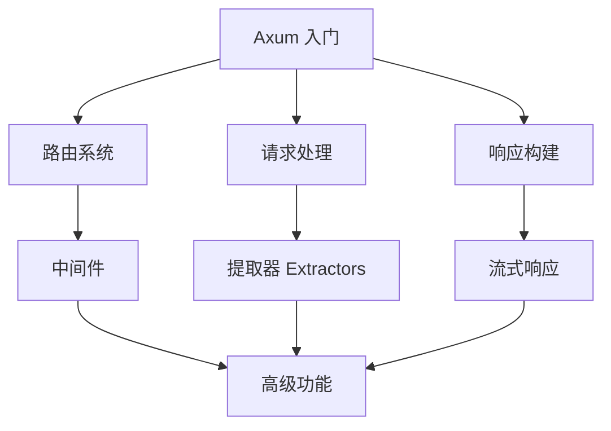

# 📚 Rust 异步编程学习资源

这个文件收集了与 `file_adapt` 项目相关的 Rust 异步编程学习资源，帮助你深入理解项目中使用的概念和技术。

## 🎯 核心概念学习路径

### 1. Rust 基础
如果你是 Rust 新手，建议先掌握基础概念：

- [📘 Rust 程序设计语言（官方图书）](https://doc.rust-lang.org/book/)
- [🇨🇳 Rust 程序设计语言（中文版）](https://kaisery.github.io/trpl-zh-cn/)
- [Rust By Example](https://doc.rust-lang.org/rust-by-example/)
- [Rustlings - 交互式 Rust 练习](https://github.com/rust-lang/rustlings)

### 2. 异步编程基础
理解 Rust 异步编程的核心概念：

- [📘 异步 Rust 编程指南](https://rust-lang.github.io/async-book/)
- [🇨🇳 异步 Rust 编程指南（中文版）](https://github.com/rustlang-cn/async-book)
- [Tokio 官方教程](https://tokio.rs/tokio/tutorial)
- [Async/Await 语法详解](https://doc.rust-lang.org/std/keyword.async.html)

### 3. Web 开发基础
学习使用 Rust 进行 Web 开发：

- [Axum 官方文档](https://docs.rs/axum/)
- [Axum GitHub 仓库](https://github.com/tokio-rs/axum)
- [HTTP 协议基础](https://developer.mozilla.org/zh-CN/docs/Web/HTTP)
- [REST API 设计指南](https://restfulapi.net/)

## 🛠 项目相关技术深度学习

### Axum 框架


**推荐资源：**
- [Axum 0.8 发行说明](https://github.com/tokio-rs/axum/releases/tag/axum-v0.8.0)
- [Axum 示例代码](https://github.com/tokio-rs/axum/tree/main/examples)
- [Axum Cookbook](https://github.com/tokio-rs/axum/blob/main/cookbook.md)

### Tokio 异步运行时
**核心组件：**
- [`tokio::main`](https://docs.rs/tokio/latest/tokio/attr.main.html) - 异步运行时宏
- [`tokio::fs`](https://docs.rs/tokio/latest/tokio/fs/index.html) - 异步文件系统操作
- [`tokio::net`](https://docs.rs/tokio/latest/tokio/net/index.html) - 异步网络编程

**学习资源：**
- [Tokio 官方网站](https://tokio.rs/)
- [Tokio API 文档](https://docs.rs/tokio/)
- [Tokio 教程](https://tokio.rs/tokio/tutorial)

### 流处理 (Stream)
**关键概念：**
- [`tokio_stream`](https://docs.rs/tokio-stream/) - 异步流处理库
- [`StreamExt` trait](https://docs.rs/futures/0.3/futures/prelude/trait.StreamExt.html) - 流操作方法
- [`Stream::map`](https://docs.rs/futures/0.3/futures/stream/trait.StreamExt.html#method.map) - 流转换

**实践项目：**
- [流处理示例](https://github.com/tokio-rs/tokio/blob/master/tokio/examples/echo.rs)
- [WebSocket 流式通信](https://github.com/tokio-rs/axum/blob/main/examples/websocket.rs)

## 🎓 分级学习计划

### 初级 (1-2周)
**目标：** 理解项目基本结构

- [ ] 完成 [Rustlings](https://github.com/rust-lang/rustlings) 练习
- [ ] 阅读 [Rust Book](https://doc.rust-lang.org/book/) 前半部分
- [ ] 运行并修改 `file_adapt` 项目
- [ ] 理解 `async/await` 基本语法

**实践任务：**
```rust
// 尝试修改项目，让它读取其他文件
// 尝试改变内容转换逻辑（比如小写、反转等）
// 尝试添加更多的路由
```

### 中级 (2-4周)
**目标：** 掌握异步编程核心概念

- [ ] 阅读 [异步 Rust 指南](https://rust-lang.github.io/async-book/)
- [ ] 学习 Tokio 教程
- [ ] 理解 `Future` 和 `Stream` 概念
- [ ] 实现更复杂的流处理逻辑

**实践任务：**
```rust
// 实现文件大小限制
// 添加并发请求处理
// 实现进度报告功能
// 添加错误重试机制
```

### 高级 (1-2个月)
**目标：** 深入理解并发和性能

- [ ] 学习 Rust 并发编程
- [ ] 理解 Pin 和 Unpin 概念
- [ ] 学习性能优化技巧
- [ ] 了解 Rust 内存模型

**实践任务：**
```rust
// 实现文件上传功能
// 添加认证和授权
// 实现文件缓存机制
// 添加监控和指标收集
```

## 🔍 常见问题解答

### Q: 什么是异步编程？为什么要使用异步？
**A:** 异步编程允许程序在等待 I/O 操作（如文件读写、网络请求）时执行其他任务，提高程序并发性能和响应速度。

**相关资源：**
- [异步 vs 同步编程](https://rust-lang.github.io/async-book/01_getting_started/02_why_async.html)
- [异步编程模式](https://tokio.rs/tokio/tutorial/spawning)

### Q: `#[tokio::main]` 宏的作用是什么？
**A:** 它将同步的 `main` 函数转换为异步函数，并创建 Tokio 运行时来执行异步代码。

**相关资源：**
- [Tokio 运行时](https://tokio.rs/tokio/tutorial/spawning)
- [宏的工作原理](https://doc.rust-lang.org/book/ch19-06-macros.html)

### Q: 什么是流式响应？有什么优势？
**A:** 流式响应是逐块发送数据，而不是等待整个响应准备完成。优势包括：
- 更低的内存使用
- 更快的首字节响应时间
- 更好的用户体验

**相关资源：**
- [HTTP 流式响应](https://developer.mozilla.org/zh-CN/docs/Web/API/Streams_API)
- [Axum 流式响应示例](https://github.com/tokio-rs/axum/blob/main/examples/streaming.rs)

### Q: 如何处理异步错误？
**A:** Rust 使用 `Result<T, E>` 类型处理错误，异步代码中的错误处理与同步代码类似，但需要使用 `?` 操作符或 `match` 表达式。

**相关资源：**
- [错误处理指南](https://doc.rust-lang.org/book/ch09-02-recoverable-errors-with-result.html)
- [异步错误处理](https://rust-lang.github.io/async-book/02_execution/04_error.html)

## 🚀 进阶主题

### 性能优化
- [Rust 性能调优指南](https://nnethercote.github.io/perf-book/)
- [Tokio 性能最佳实践](https://tokio.rs/tokio/tutorial/production)
- [内存管理和零拷贝](https://doc.rust-lang.org/nomicon/borrowing.html)

### 生产部署
- [Docker 容器化 Rust 应用](https://github.com/rust-lang/docker-rust)
- [Nginx 反向代理配置](https://nginx.org/en/docs/http/ngx_http_proxy_module.html)
- [监控和日志记录](https://github.com/tokio-rs/tracing)

### 安全性
- [Rust 安全编程指南](https://doc.rust-lang.org/nomicon/)
- [Web 应用安全最佳实践](https://owasp.org/www-project-web-security-testing-guide/)
- [输入验证和清理](https://owasp.org/www-project-top-ten/2017/A1_2017-Injection)

## 🤝 社区和支持

### 中文社区
- [Rust 中文社区](https://rust.cc/)
- [Rust 中文论坛](https://users.rust-lang.org/c/10-chinese)
- [Rust 中文学习小组](https://github.com/rust-lang-cn)

### 国际社区
- [Rust 用户论坛](https://users.rust-lang.org/)
- [Reddit r/rust](https://www.reddit.com/r/rust/)
- [Stack Overflow](https://stackoverflow.com/questions/tagged/rust)

### 实时交流
- [Rust Discord 服务器](https://discord.gg/rust-lang)
- [Rust 用户邮件列表](https://mail.python.org/mailman/listinfo/rust-users)

## 📈 项目扩展思路

基于 `file_adapt` 项目，可以尝试以下扩展：

1. **多格式文件服务**
   - JSON/YAML 格式化
   - 代码语法高亮
   - Markdown 渲染

2. **文件管理系统**
   - 文件上传/下载
   - 目录浏览
   - 文件搜索

3. **实时数据流**
   - 日志文件监控
   - WebSocket 实时更新
   - Server-Sent Events

4. **微服务架构**
   - API 网关
   - 服务发现
   - 负载均衡

---

**💡 提示：** 学习编程最重要的是实践。不要只看教程，一定要动手写代码、修改代码、创造新的功能！

**🔄 持续更新：** 这个资源列表会持续更新，欢迎贡献新的学习资源！